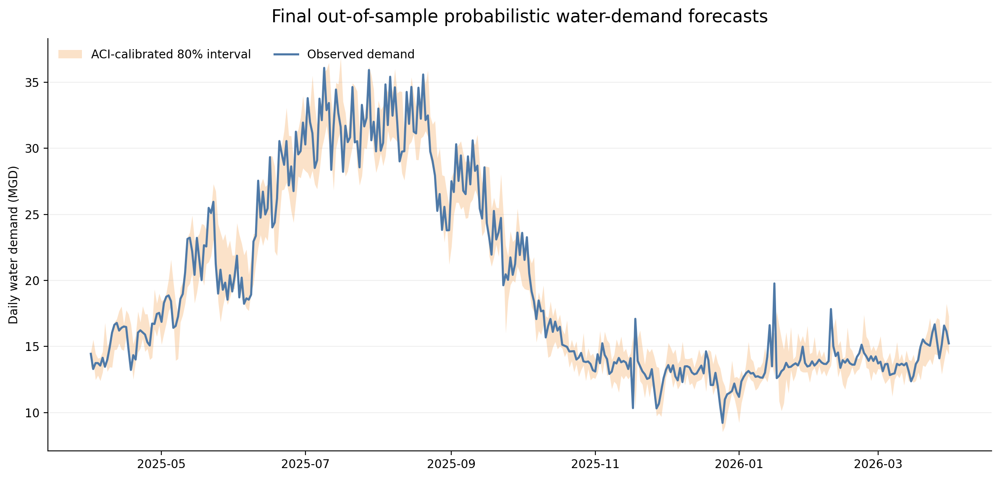
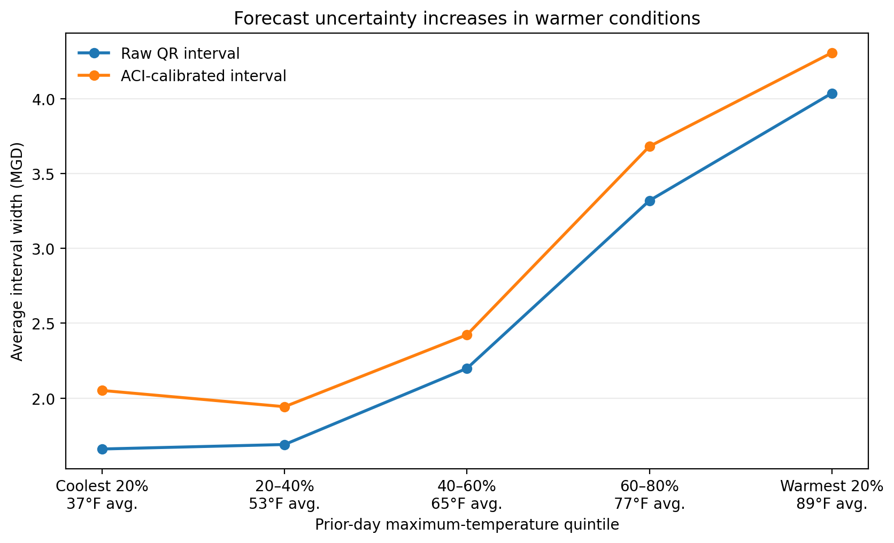

# Municipal Water Demand Forecasting
A reproducible one-day-ahead forecasting project combining Fort Collins water-demand data with NOAA weather observations.

The final XGBoost point forecast achieved a holdout mean absolute error of **0.876 million gallons per day**, improving on previous-day persistence by **31.8%** and ridge regression by **11.8%**.

I then extended the project to probabilistic forecasting. A linear quantile-regression model combined with sequential conformal calibration produced **78.6% empirical coverage** for a nominal 80% interval during the final April 2025–March 2026 out-of-sample probabilistic evaluation.

## Overview

Municipal water demand follows a strong annual cycle, but it can also change quickly in response to weather, calendar effects and recent consumption.

This project asks a practical forecasting question:

> Can tomorrow's municipal water demand be predicted more accurately using recent demand, calendar information and lagged weather than by simply using today's demand?

I developed the project as an application of statistical modeling and time-series forecasting to a water-management problem. I was interested not only in whether a more flexible model could improve forecast accuracy, but also in when it helped and where it still failed.

The project uses public data and chronological validation throughout. Point-model features, model families and hyperparameters were fixed before the original final holdout was viewed. The later probabilistic system was developed separately using earlier chronological forecasts, with its quantile-regression and calibration choices fixed before the final out-of-sample probabilistic evaluation.

## Why I built this project

My academic work has focused on machine learning, uncertainty quantification and scalable numerical methods. I built this project to explore how those skills could be applied to a practical utility-planning problem.

Public water-system reports often distinguish between observed demand and weather-normalized demand. That raised several related questions for me:

- How much of tomorrow's demand can be predicted from recent consumption?
- Does lagged weather provide useful information beyond demand history and seasonality?
- Do linear and nonlinear models use that information differently?
- Under what conditions does a forecasting model fail?

Rather than begin with a preferred method, I organized the project around a transparent comparison of simple baselines, linear models and a nonlinear tree-based model.

## Forecasting task

The target is daily municipal water demand measured in **million gallons per day**, abbreviated MGD.

The forecasting horizon is one day:

```math
\widehat{y}_{t+1}=f(\mathcal{I}_t)
```

Here, $\mathcal{I}_t$ represents the information available through day $t$.

The operational feature set includes only information that would be available by the end of the previous day. Same-day observed weather is evaluated only as a retrospective benchmark and is not used by the final operational model.

## Data

The processed dataset combines:

- daily Fort Collins water demand from the City of Fort Collins
- daily weather observations from NOAA station `USC00053005`
- calendar and holiday information derived from each forecast date

The processed data cover **January 1, 2020 through March 31, 2026** and contain **2,282 complete daily observations**.

Weather variables include temperature, precipitation and snow. Lagged demand variables include recent daily demand, rolling means and rolling variability.

The source data are downloaded and processed through scripts in `src/data/`. The resulting modeling dataset is stored at:

```text
data/processed/fort_collins_daily_water_weather.csv
```

## Evaluation design

All evaluation is chronological, using an **expanding-window rolling-validation design**.

For the point-forecasting analysis, the data were divided into three stages:

| Stage               | Period                  | Purpose                                   |
| ------------------- | ----------------------- | ----------------------------------------- |
| Initial development | 2020–2022               | Exploratory analysis and initial fitting  |
| Rolling validation  | January 2023–March 2025 | Feature and model comparison              |
| Final holdout       | April 2025–March 2026   | One-time final point-forecast evaluation  |

The rolling-validation stage contains nine quarterly validation folds. In each fold, the model is fitted using all observations available before the validation quarter and then evaluated on that quarter. After evaluation, the validation period is incorporated into the training history for the next fold.


*Expanding-window validation. The training window grows after each quarterly validation fold, while the final holdout remains untouched throughout point-model development.*

The final holdout was not used to choose point-forecasting features, model families or hyperparameters. After the validation analysis was completed, each final point model was fitted once using all available data through March 31, 2025 and evaluated on the following 365 days.

The probabilistic-forecasting extension was developed separately using chronological out-of-fold forecasts from January 2023 through March 2025. The quantile-regression specification, conformal-calibration method, 180-day conformity-score history and ACI adaptation rate were all fixed before probabilistic performance was examined over April 2025–March 2026. Because that same calendar period had already been inspected during the point-forecasting analysis, I describe this as a final out-of-sample probabilistic evaluation rather than as a newly untouched holdout.

For point forecasts, I use **mean absolute error (MAE)** as the primary metric because it measures the typical forecast error directly in million gallons per day, making the result easy to interpret on the same scale as the forecasting problem. **Root mean squared error (RMSE)** is reported as a secondary metric because its greater sensitivity to large errors helps reveal whether improvements in average accuracy come at the cost of occasional large misses. **Mean absolute percentage error (MAPE)** provides an additional percentage-scale summary. Using these complementary measures follows standard forecasting practice ([Hyndman & Athanasopoulos, 2021](https://otexts.com/fpp3/accuracy.html)).

For probabilistic forecasts, I focus on **empirical interval coverage** relative to the nominal 80% target together with **interval width**, lower- and upper-tail miss rates and quantile pinball loss. Coverage measures calibration, while interval width helps distinguish useful calibration from intervals that achieve coverage simply by becoming excessively wide.

## Models compared

I began with simple benchmarks before introducing additional model flexibility.

| Model                    | Role                                                    |
| ------------------------ | ------------------------------------------------------- |
| Previous-day persistence | Operational baseline: tomorrow equals today             |
| Ridge-regression         | Regularized linear benchmark                            |
| XGBoost                  | Nonlinear model for thresholds and feature interactions |

Previous-day persistence establishes whether a fitted model improves on the strong short-term dependence already present in water demand. Ridge-regression then provides a relatively simple benchmark for combining recent demand, calendar effects and lagged weather. Comparing these models with XGBoost tests whether allowing nonlinear relationships and interactions provides meaningful additional predictive value. Regression models are a standard starting point for incorporating predictor information into time-series forecasts ([Hyndman & Athanasopoulos, 2021](https://otexts.com/fpp3/forecasting-regression.html)).

Principal component regression was also evaluated. Truncating low-variance directions consistently reduced forecast accuracy and so was not retained as a separate final model.

Ridge regularization produced only a small improvement in average error, but it substantially improved coefficient stability in the broader feature matrix.


## Feature set

Two related feature matrices were used during model development.

- **Matrix A** is a curated 27-feature set used for early linear-model diagnostics and matrix-geometry analysis.
- **Matrix B** is the broader 54-feature operational matrix used for the final model comparison and holdout evaluation. Its predictors come from five broad sources:

  - recent demand lags
  - rolling demand levels and variability
  - annual and weekly calendar terms
  - holiday indicators
  - lagged temperature, precipitation and snow

All lagged and rolling variables are shifted so that no forecast uses future information.

Unless otherwise noted, the final ridge-regression and XGBoost results reported below use Matrix B.

The final XGBoost specification was selected during rolling validation and was not altered after the holdout was opened.

## Final holdout results

| Model | MAE (MGD) | RMSE (MGD) | MAPE |
|---|---:|---:|---:|
| Previous-day persistence | 1.284 | 1.849 | 6.14% |
| Ridge-regression | 0.994 | 1.340 | 5.32% |
| **XGBoost** | **0.876** | **1.245** | **4.60%** |

The selected XGBoost model reduced holdout MAE by:

- **31.8%** relative to previous-day persistence
- **11.8%** relative to ridge regression

It produced lower daily absolute error than ridge on approximately 61% of holdout dates and lower error than persistence on approximately 62% of dates.


*Mean absolute error on the final holdout. XGBoost produced the lowest MAE, followed by Ridge and previous-day persistence.*

## Validation and holdout consistency

XGBoost's rolling-validation MAE was 0.838 MGD. Its final holdout MAE was 0.876 MGD, an increase of approximately 4.5%.

Its RMSE was effectively unchanged on the final holdout, remaining 1.245 MGD to three decimal places:

| Evaluation stage | XGBoost RMSE |
|---|---:|
| Rolling validation | 1.245 MGD |
| Final holdout | 1.245 MGD |

The similarity between validation and holdout performance suggests that the chronological validation procedure provided a realistic estimate of final generalization error.

The model's 90th-percentile, 95th-percentile and maximum absolute errors were also lower on the holdout than during rolling validation.

## Forecast behavior over the holdout year


*Observed daily demand and predictions from the final Ridge and XGBoost models during the April 2025–March 2026 holdout year. Both models track the annual cycle, while the largest discrepancies occur during abrupt increases, decreases and reversals.*

The seasonal difference in forecast error reflects an important feature of the underlying demand series. Demand rises sharply into the summer, when both its level and day-to-day variability are substantially greater than during the lower-demand winter months.

Summer is therefore the most difficult season in absolute terms. XGBoost's summer MAE was 1.207 MGD, compared with 0.636 MGD during winter.
However, summer is also where the model provides some of its greatest value. XGBoost improved on persistence by approximately 47% during summer and by more than 48% in both July and August.

## What the model learned

The feature analysis supports a consistent predictive interpretation.

### Recent demand is the forecast anchor

Previous-day demand is the dominant feature under both tree gain and out-of-fold SHAP importance. SHAP helps explain the model's forecasts by measuring how much each feature tends to influence its predictions; using out-of-fold observations makes this a check on behavior outside the data used for fitting. Two-day demand, seven-day demand and short rolling means provide additional information about the recent demand level.

### Calendar information provides context

Annual seasonal terms and weekday indicators help distinguish similar recent demand values occurring at different points in the year or week.

### Weather improves the operational forecast

Adding lagged weather to calendar and demand-history features reduced rolling-validation XGBoost MAE from approximately 0.906 to 0.838 MGD, an improvement of about 7.4%.

The weather-block analysis found that:

- precipitation produced the most consistent improvement across model families
- temperature contributed primarily through nonlinear effects
- snow made a smaller but positive contribution to the full nonlinear model

A retrospective model using observed same-day weather achieved still lower error, but that information would not be available when issuing a strict one-day-ahead forecast. Archived weather forecasts are therefore a natural direction for future work.

These findings are predictive rather than causal. They do not estimate the physical effect of changing weather on water use.

## Where the model struggles

The model's clearest limitation is a damped response to abrupt changes.

It recognizes many increases and decreases, but it tends to:

- underpredict sharp increases
- overpredict sharp decreases
- lag behind rapid reversals

To study this behavior, holdout dates were divided into five equally sized groups, called quintiles, according to the absolute change in demand from the previous day.

Each quintile contains approximately 20% of the holdout observations. The first group contains the smallest daily changes and the fifth contains the largest.


*Mean absolute error on the final holdout, grouped by the magnitude of the observed day-to-day demand change. Previous-day persistence is hardest to beat when demand is most stable, while XGBoost provides its largest gains during larger transitions.*

| Daily-change group | Description | XGBoost skill relative to persistence |
|---|---|---:|
| Smallest-change quintile | Smallest 20% of daily changes | −280.8% |
| Second quintile | Next 20% of daily changes | −26.5% |
| Middle quintile | Middle 20% of daily changes | 5.3% |
| Fourth quintile | Next-largest 20% of daily changes | 41.5% |
| Largest-change quintile | Largest 20% of daily changes | 48.2% |

The negative percentages in the most stable groups do not mean that XGBoost fails overall. They show that a model which adjusts away from yesterday's demand can introduce error when almost no adjustment was needed.

For the largest increases, XGBoost underpredicted demand by approximately 1.27 MGD on average. For the largest decreases, it overpredicted by approximately 1.21 MGD.

The largest holdout error occurred on January 16, 2026, when demand increased by 6.28 MGD and the model underpredicted by 6.05 MGD. Demand then fell sharply the following day, producing an overprediction.

This illustrates how a strong recent-demand signal can become temporarily misleading during rapid reversals.

## Additional point-forecasting diagnostics

Several additional analyses were used to evaluate the modeling decisions.

### Linear-system geometry

The curated 27-feature matrix was well conditioned after standardization. The broader 54-feature matrix was more correlated, primarily because direct demand lags and rolling demand summaries contain overlapping information.

The broader matrix nevertheless improved prediction. Ridge regularization reduced coefficient variation and the condition number of the penalized system without discarding predictive directions.

### Principal component regression

PCR truncation did not improve validation performance. Even specifications retaining more than 99% of predictor variance performed worse than full ordinary least squares.

This indicates that several low-variance directions contained useful predictive information. Predictor variance alone was therefore not a reliable feature-selection criterion.

### Model interpretation

Out-of-fold SHAP values were calculated only for validation observations, with the selected XGBoost model refitted separately within each fold.

The leading predictors were stable across folds, though correlated demand and weather variables sometimes exchanged lower-ranked importance. Feature groups, ablation results and multiple importance measures were therefore emphasized over exact individual rankings.

### Residual dependence

The final XGBoost residuals showed little immediate dependence:

- lag-one residual autocorrelation: 0.008
- lag-seven residual autocorrelation: 0.109

Longer-range structure remained at 14 and 28 days. The final residuals should not be treated as completely independent.

## From point forecasts to uncertainty

Point forecasts answer only part of the forecasting problem. A utility may also want
to know when tomorrow's demand estimate is relatively precise and when a wider range
of outcomes is more plausible.

I therefore implemented a simple **probabilistic water-demand forecasting** analysis using the
same chronological evaluation philosophy as the point-forecasting analysis. Quantile
regression provides a direct way to estimate conditional percentiles rather than only
the conditional mean, and has been studied specifically for one-day-ahead probabilistic
urban water-demand forecasting
([Papacharalampous & Langousis, 2022](https://doi.org/10.1029/2021WR030216)).

I began with linear quantile regression as a transparent benchmark, estimating the conditional 10th, 50th and 90th percentiles of demand. 
The resulting central interval contained about **74.4%** of observations over the 2023–March 2025 chronological evaluation period rather than its nominal 80%.

This motivated a second question: could the quantile forecasts be improved using conformal prediction? Conformal prediction is a relatively modern framework for uncertainty quantification that calibrates prediction intervals using observed forecast errors, with classical methods providing finite-sample coverage guarantees under exchangeability. Extensions such as conformalized quantile regression and methods designed for time-series data adapt this idea to quantile forecasts and temporally ordered observations.

Conformalized quantile regression provides a general framework for combining
quantile forecasts with distribution-free calibration
([Romano et al., 2019](https://proceedings.neurips.cc/paper/2019/hash/5103c3584b063c431bd1268e9b5e76fb-Abstract.html)).
Because water demand is a time series rather than an exchangeable regression sample,
I focused on sequential variants designed to adapt as forecast errors evolve through
time. These included **Adaptive Conformal Inference**
([Gibbs & Candès, 2021](https://proceedings.neurips.cc/paper/2021/hash/0d441de75945e5acbc865406fc9a2559-Abstract.html))
and **Conformal PID**
([Angelopoulos et al., 2023](https://proceedings.neurips.cc/paper_files/paper/2023/hash/47f2fad8c1111d07f83c91be7870f8db-Abstract-Conference.html)),
along with a simpler rolling conformal baseline.

The comparison led to the selection of **two-sided ACI with a 180-day
conformity-score history**. On the 2023–March 2025 evaluation period, calibration
increased empirical coverage from **74.4% to 80.6%**, with average interval width
increasing from **2.58 to 2.88 MGD**. Lower- and upper-tail miss rates were both
close to 10%.

## Final out-of-sample probabilistic evaluation

After selecting the probabilistic forecasting system using the 2023–March 2025 chronological evaluation period, I fixed the model and calibration choices before examining probabilistic performance over the subsequent year. The three linear quantile-regression models were fitted once using all eligible observations through March 31, 2025. The previously selected two-sided ACI procedure with a 180-day conformity-score history was then continued sequentially from its pre-evaluation state, using each observed outcome only to update the calibration applied to future forecasts.

Because April 2025–March 2026 had already been examined during the separate point-forecasting analysis, I treat this as a final out-of-sample probabilistic evaluation rather than as a newly untouched holdout.

The raw 10th-to-90th percentile quantile-regression interval covered **71.8%** of observations, below its nominal 80% target. Sequential ACI increased coverage to **78.6%**, a gain of **6.8 percentage points**, while average interval width increased from 2.709 to 3.008 MGD.

| Method                   |  Coverage | Average width |  Median width | Lower-tail misses | Upper-tail misses |
| ------------------------ | --------: | ------------: | ------------: | ----------------: | ----------------: |
| Raw linear QR            |     71.8% |     2.709 MGD |     2.410 MGD |             14.5% |             13.7% |
| **Two-sided ACI (180d)** | **78.6%** | **3.008 MGD** | **2.740 MGD** |         **10.4%** |         **11.0%** |

The calibrated intervals therefore recovered most of the raw QR coverage gap with an average-width increase of approximately **11.1%**. The remaining misses were also well balanced between the lower and upper tails.



*Observed daily water demand and the ACI-calibrated 80% prediction interval during the April 2025–March 2026 final out-of-sample probabilistic evaluation. The interval width changes substantially through the year, reflecting both variation in the underlying quantile forecasts and sequential calibration based on recent forecast errors.*

The annual result is close to the nominal target, but it does not imply uniform calibration across every period or demand regime. The next section examines how forecast uncertainty and calibration vary with weather, season and changing forecast conditions.

## Interpreting forecast uncertainty
The prediction intervals provide information that a point forecast alone cannot: their changing width indicates when daily demand is relatively predictable and when a wider range of outcomes is plausible.

Most of that day-to-day variation is already present in the underlying quantile-regression forecasts. In the earlier chronological evaluation period, the raw 80% QR interval widened from approximately 1.66 MGD in the coolest prior-day temperature quintile to 4.04 MGD in the warmest. About three-quarters of the widest 10% of calibrated intervals also occurred during summer.



This pattern is consistent with the point-forecasting results: warmer conditions tend to coincide with both higher demand and greater variability. The probabilistic model therefore does not merely predict a higher level of water use on warm days; it also represents those forecasts as less certain.

The final out-of-sample evaluation reinforces this interpretation. Raw QR intervals were already widest during summer, averaging approximately 4.30 MGD. ACI did not improve summer coverage and slightly reduced average interval width, suggesting that much of the additional uncertainty associated with high-demand conditions was already represented by the conditional quantile forecasts.

The largest incremental calibration gains instead appeared in fall and winter. Fall coverage increased from **65.9% to 81.3%**, while winter coverage increased from **71.1% to 80.0%**. These seasonal summaries are descriptive rather than separate calibration targets because the ACI controller evolves continuously through time rather than restarting at seasonal boundaries.

This highlights a useful division of labor between the two components of the forecasting system:

- **Quantile regression describes how forecast uncertainty changes with observed conditions.**
- **ACI provides a sequential correction when recent forecast errors indicate that the raw intervals are poorly calibrated.**

ACI is therefore not acting as a second weather model or applying a fixed inflation factor to every interval. Its adjustment changes through time according to recent forecast performance. In the final evaluation, 90-day rolling ACI coverage ranged from approximately **73.3% to 85.6%**, illustrating that annual coverage near the nominal target does not imply perfectly uniform local calibration.

These relationships should be interpreted as predictive rather than causal. Temperature, season and related weather variables help identify periods when demand is more difficult to forecast, but this analysis does not isolate the causal effect of any individual factor. Other influences—such as precipitation, irrigation behavior, holidays, changing customer behavior or variables not available in the public data—may contribute to the same patterns.

Taken together, the point and probabilistic forecasts provide two complementary pieces of information: an estimate of likely daily demand and an indication of when that estimate should be treated with more or less uncertainty. The conditional quantile model captures much of the changing forecast difficulty directly, while sequential conformal calibration provides an additional safeguard when recent forecast errors suggest that those uncertainty estimates have become too optimistic or conservative.

## Repository structure

```text
municipal-water-demand-forecasting/
├── config/
│   ├── data_sources.yml
│   └── modeling.yml
├── data/
│   ├── raw/
│   └── processed/
├── docs/
│   ├── methodological_decisions.md
│   └── references.bib
├── notebooks/
│   ├── 01_exploratory_analysis.ipynb
│   ├── 02_model_comparison.ipynb
│   ├── 03_probabilistic_forecasting.ipynb
│   ├── 04_time_series_uncertainty_calibration.ipynb
│   ├── 05_interpreting_probabilistic_forecasts.ipynb
│   └── 06_readme_visualizations.ipynb
├── reports/
│   ├── figures/
│   ├── probabilistic/
│   │   ├── calibration/
│   │   ├── interpretation/
│   │   └── final_holdout/
│   ├── final_holdout_metrics.csv
│   ├── final_holdout_predictions.csv
│   └── final_holdout_evaluation.json
├── src/
│   ├── data/
│   ├── evaluation/
│   └── features/
├── .gitignore
├── README.md
└── requirements.txt
```

## Main project files

The principal analysis files are:

- [`notebooks/01_exploratory_analysis.ipynb`](notebooks/01_exploratory_analysis.ipynb)  
  Data review, exploratory analysis, leakage-safe feature design and matrix geometry.

- [`notebooks/02_model_comparison.ipynb`](notebooks/02_model_comparison.ipynb)  
  Baselines, linear models, XGBoost, ablations, SHAP analysis, residual diagnostics and final holdout evaluation.

- [`notebooks/03_probabilistic_forecasting.ipynb`](notebooks/03_probabilistic_forecasting.ipynb)  
  Linear quantile regression and quantile XGBoost comparison, probabilistic scoring and calibration diagnostics.

- [`notebooks/04_time_series_uncertainty_calibration.ipynb`](notebooks/04_time_series_uncertainty_calibration.ipynb)  
  Sequential conformal calibration, window-length selection and comparison of rolling CQR, ACI and conformal PID.

- [`notebooks/05_interpreting_probabilistic_forecasts.ipynb`](notebooks/05_interpreting_probabilistic_forecasts.ipynb)  
  Interpretation of the selected QR + ACI system across weather and seasonal regimes, followed by the final April 2025–March 2026 out-of-sample probabilistic evaluation.

- [`notebooks/06_readme_visualizations.ipynb`](notebooks/06_readme_visualizations.ipynb)  
  Reproducible generation of the polished figures used throughout this README.
  
Supporting project files include:

- [`config/modeling.yml`](config/modeling.yml)  
  Forecast horizon, chronological splits, evaluation metrics and modeling configuration.

- [`docs/methodological_decisions.md`](docs/methodological_decisions.md)  
  Record of project decisions and their rationale.

- [`notebooks/06_readme_visualizations.ipynb`](notebooks/06_readme_visualizations.ipynb)  
  Reproducible generation of README figures.

- [`reports/final_holdout_metrics.csv`](reports/final_holdout_metrics.csv)  
  Final point-model metrics.

- [`reports/final_holdout_predictions.csv`](reports/final_holdout_predictions.csv)  
  Daily observations and point forecasts for the April 2025–March 2026 final point-model holdout.

- [`reports/probabilistic/final_holdout/`](reports/probabilistic/final_holdout/)  
  Daily forecasts, interval summaries, rolling diagnostics and seasonal results from the final probabilistic evaluation.

## Reproducing the analysis

The reported analysis was tested with **Python 3.12.13** and the package versions
pinned in `requirements.txt`.

## Reproducing the analysis

Create a Python environment and install the project dependencies:

```bash
pip install -r requirements.txt
```

The data workflow is organized under `src/data/`:

```text
download_water_demand.py
download_noaa_weather.py
validate_raw_data.py
build_daily_dataset.py
```

Data-source settings are stored in `config/data_sources.yml`. Modeling periods and evaluation settings are stored in `config/modeling.yml`.

After building the processed dataset, run the analysis notebooks in order:

1. `notebooks/01_exploratory_analysis.ipynb`
2. `notebooks/02_model_comparison.ipynb`
3. `notebooks/03_probabilistic_forecasting.ipynb`
4. `notebooks/04_time_series_uncertainty_calibration.ipynb`
5. `notebooks/05_interpreting_probabilistic_forecasts.ipynb`

The point-forecasting holdout outputs are stored directly under `reports/`.
Probabilistic model-selection and calibration outputs are stored under
`reports/probabilistic/calibration/`, interpretation outputs under
`reports/probabilistic/interpretation/`, and the final out-of-sample probabilistic
evaluation under `reports/probabilistic/final_holdout/`.

README figures can be regenerated after the analysis is complete with
`notebooks/06_readme_visualizations.ipynb`.

## Project status

The current point-forecasting and probabilistic-forecasting analyses are complete.

The April 2025–March 2026 period has now been used for the final point-forecasting evaluation and, after all probabilistic modeling and calibration choices were fixed, for a separate final out-of-sample probabilistic evaluation. It will not be reused for additional feature selection, hyperparameter tuning, calibration-method selection or model comparison.

Potential extensions include:

- archived one-day-ahead weather forecasts
- dynamic blending of persistence and XGBoost
- explicit transition-day or regime-switching models
- multi-step or hourly probabilistic forecasting
- evaluation on another municipal water system
- an interactive forecasting and conservation dashboard

## Closing reflection

This project reinforced an important forecasting lesson for me: a more flexible model does not need to win every day to be useful.

Previous-day persistence remains extremely difficult to beat when demand is stable. XGBoost provides its greatest value during high-demand periods and substantial transitions, even though those same periods contain some of its largest remaining errors. Looking only at average performance would have hidden that distinction.

The probabilistic analysis added a related lesson. A useful uncertainty estimate requires more than attaching a fixed margin around a point forecast. Quantile regression captured much of the way forecast difficulty changes with weather and season, while sequential conformal calibration responded when recent forecast errors showed that those conditional intervals had become too optimistic or conservative.

I found that division of labor particularly useful. The underlying model describes what can be learned from the available predictors; the calibration layer provides a way to respond when recent performance indicates that the model's uncertainty estimates are no longer adequate.

More broadly, the project reinforced the value of beginning with simple baselines, evaluating chronologically and treating model limitations as part of the result rather than something to hide. The final system is not uniformly best in every regime and its probabilistic coverage is not perfectly constant through time, but those limitations help identify where additional data, better weather information or different modeling assumptions would be most valuable.
