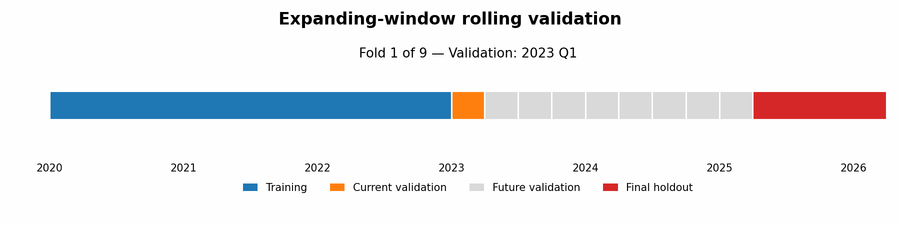
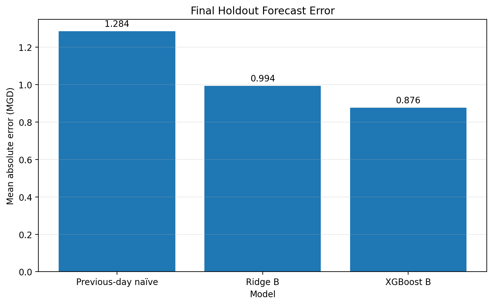
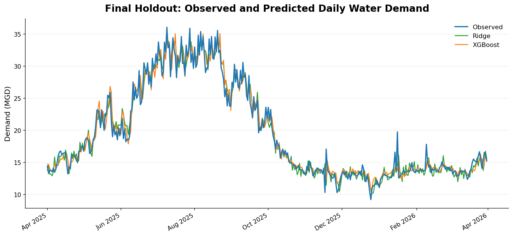
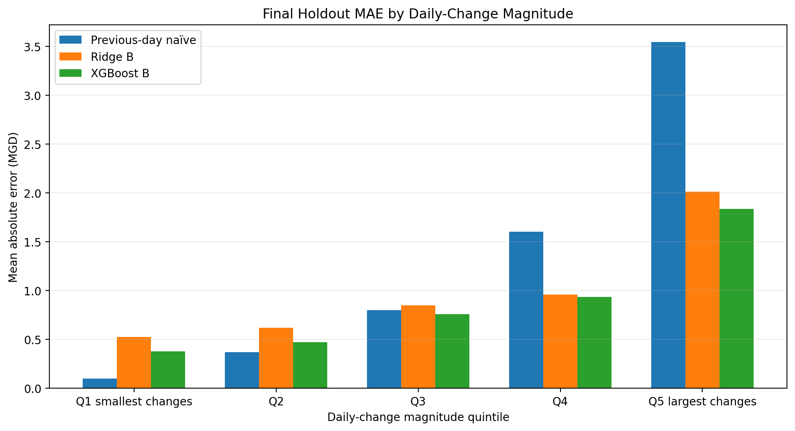

# Municipal Water Demand Forecasting

A reproducible one-day-ahead forecasting project combining Fort Collins water-demand data with NOAA weather observations.

The final XGBoost model achieved a holdout mean absolute error of **0.876 million gallons per day**, improving on previous-day persistence by **31.8%** and ridge regression by **11.8%**.

## Overview

Municipal water demand follows a strong annual cycle, but it can also change quickly in response to weather, calendar effects and recent consumption.

This project asks a practical forecasting question:

> Can tomorrow's municipal water demand be predicted more accurately using recent demand, calendar information and lagged weather than by simply using today's demand?

I developed the project as an application of statistical modeling and time-series forecasting to a water-management problem. I was interested not only in whether a more flexible model could improve forecast accuracy, but also in when it helped and where it still failed.

The project uses public data, chronological validation and a final untouched holdout period. Feature choices, model families and hyperparameters were fixed before the holdout results were viewed.

## Why I built this project

My academic work has focused on machine learning, uncertainty quantification and scalable numerical methods. I built this project to explore how those skills could be applied to a practical water-conservation and utility-planning problem.

Public water-system reports often distinguish between observed demand and weather-normalized demand. That raised several related questions for me:

- How much of tomorrow's demand can be predicted from recent consumption?
- Does lagged weather provide useful information beyond demand history and seasonality?
- Do linear and nonlinear models use that information differently?
- Under what conditions does a forecasting model fail?

Rather than begin with a preferred method, I organized the project around a transparent comparison of simple baselines, linear models and a nonlinear tree-based model.

## Forecasting task

The target is daily municipal water demand measured in **million gallons per day**, abbreviated MGD.

The forecasting horizon is one day:

```math
\widehat{y}_{t+1}=f(\mathcal{I}_t)
```

Here, $\mathcal{I}_t$ represents the information available through day $t$.

The operational feature set includes only information that would be available by the end of the previous day. Same-day observed weather is evaluated only as a retrospective benchmark and is not used by the final operational model.

## Data

The processed dataset combines:

- daily Fort Collins water demand from the City of Fort Collins
- daily weather observations from NOAA station `USC00053005`
- calendar and holiday information derived from each forecast date

The processed data cover **January 1, 2020 through March 31, 2026** and contain **2,282 complete daily observations**.

Weather variables include temperature, precipitation and snow. Lagged demand variables include recent daily demand, rolling means and rolling variability.

The source data are downloaded and processed through scripts in `src/data/`. The resulting modeling dataset is stored at:

```text
data/processed/fort_collins_daily_water_weather.csv
```

## Evaluation design

All evaluation is chronological, using an **expanding-window rolling-validation design**.

The data were divided into three stages:

| Stage               | Period                  | Purpose                                  |
| ------------------- | ----------------------- | ---------------------------------------- |
| Initial development | 2020–2022               | Exploratory analysis and initial fitting |
| Rolling validation  | January 2023–March 2025 | Feature and model comparison             |
| Final holdout       | April 2025–March 2026   | One-time final evaluation                |

The rolling-validation stage contains nine quarterly validation folds. In each fold, the model is fitted using all observations available before the validation quarter and then evaluated on that quarter. After evaluation, the validation period is incorporated into the training history for the next fold.



*Expanding-window validation. The training window grows after each quarterly validation fold, while the final holdout remains untouched throughout model development.*

The final holdout was not used to choose features, model families or hyperparameters. After the validation analysis was completed, each final model was fitted once using all available data through March 31, 2025 and evaluated on the following 365 days.

**Mean absolute error (MAE)** is the primary metric because it measures the typical forecast error directly in million gallons per day, making the result easy to interpret on the same scale as the forecasting problem. **Root mean squared error (RMSE)** is reported as a secondary metric because its greater sensitivity to large errors helps reveal whether improvements in average accuracy come at the cost of occasional large misses. **Mean absolute percentage error (MAPE)** provides an additional percentage-scale summary. Using these complementary measures follows standard forecasting practice ([Hyndman & Athanasopoulos, 2021](https://otexts.com/fpp3/accuracy.html)).

## Models compared

The model comparison deliberately begins with simple benchmarks before introducing additional flexibility.

| Model                    | Role                                                    |
| ------------------------ | ------------------------------------------------------- |
| Previous-day persistence | Operational baseline: tomorrow equals today             |
| Ridge regression         | Regularized linear benchmark                            |
| XGBoost                  | Nonlinear model for thresholds and feature interactions |

Previous-day persistence establishes whether a fitted model improves on the strong short-term dependence already present in water demand. Ridge regression then provides a relatively simple benchmark for combining recent demand, calendar effects and lagged weather. Comparing these models with XGBoost tests whether allowing nonlinear relationships and interactions provides meaningful additional predictive value. Regression models are a standard starting point for incorporating predictor information into time-series forecasts ([Hyndman & Athanasopoulos, 2021](https://otexts.com/fpp3/forecasting-regression.html)).

Principal component regression was also evaluated. Truncating low-variance directions consistently reduced forecast accuracy, so full-component PCR reproduced ordinary least squares and was not retained as a separate final model.

Ridge regularization produced only a small improvement in average error, but it substantially improved coefficient stability in the broader feature matrix.


## Feature set

The final operational feature matrix contains 54 predictors from five broad sources:

- recent demand lags
- rolling demand levels and variability
- annual and weekly calendar terms
- holiday indicators
- lagged temperature, precipitation and snow

All lagged and rolling variables are shifted so that no forecast uses future information.

The final XGBoost specification was selected during rolling validation and was not altered after the holdout was opened.

## Final holdout results

| Model | MAE (MGD) | RMSE (MGD) | MAPE |
|---|---:|---:|---:|
| Previous-day persistence | 1.284 | 1.849 | 6.14% |
| Ridge regression | 0.994 | 1.340 | 5.32% |
| **XGBoost** | **0.876** | **1.245** | **4.60%** |

The selected XGBoost model reduced holdout MAE by:

- **31.8%** relative to previous-day persistence
- **11.8%** relative to ridge regression

It produced lower daily absolute error than ridge on approximately 61% of holdout dates and lower error than persistence on approximately 62% of dates.



*Final holdout performance. XGBoost produced the lowest mean absolute error, followed by ridge regression and previous-day persistence.*

## Validation and holdout consistency

XGBoost's rolling-validation MAE was 0.838 MGD. Its final holdout MAE was 0.876 MGD, an increase of approximately 4.5%.

Its RMSE was nearly unchanged:

| Evaluation stage | XGBoost RMSE |
|---|---:|
| Rolling validation | 1.245 MGD |
| Final holdout | 1.245 MGD |

The similarity between validation and holdout performance suggests that the chronological validation procedure provided a realistic estimate of final generalization error.

The model's 90th-percentile, 95th-percentile and maximum absolute errors were also lower on the holdout than during rolling validation.

## Forecast behavior over the holdout year



*Observed and predicted demand from April 2025 through March 2026. Both fitted models track the annual cycle, while the largest discrepancies occur during abrupt increases, decreases and reversals.*

Summer remains the most difficult season in absolute terms. XGBoost's summer MAE was 1.207 MGD, compared with 0.636 MGD during winter.

However, summer is also where the model provides some of its greatest value. XGBoost improved on persistence by approximately 47% during summer and by more than 48% in both July and August.

During stable lower-demand months, previous-day persistence remains difficult to beat. XGBoost was slightly worse than persistence in April and March and was nearly tied in December.

## What the model learned

The feature analysis supports a consistent predictive interpretation.

### Recent demand is the forecast anchor

Previous-day demand is the dominant feature under both tree gain and out-of-fold SHAP importance. Two-day demand, seven-day demand and short rolling means provide additional information about the recent level.

### Calendar information provides context

Annual seasonal terms and weekday indicators help distinguish similar recent demand values occurring at different points in the year or week.

### Weather improves the operational forecast

Adding lagged weather to calendar and demand-history features reduced rolling-validation XGBoost MAE from approximately 0.906 to 0.838 MGD, an improvement of about 7.4%.

The weather-block analysis found that:

- precipitation produced the most consistent improvement across model families
- temperature contributed primarily through nonlinear effects
- snow made a smaller but positive contribution to the full nonlinear model

A retrospective model using observed same-day weather achieved still lower error, but that information would not be available when issuing a strict one-day-ahead forecast. Archived weather forecasts are therefore a natural direction for future work.

These findings are predictive rather than causal. They do not estimate the physical effect of changing weather on water use.

## Where the model struggles

The model's clearest limitation is a damped response to abrupt changes.

It recognizes many increases and decreases, but it tends to:

- underpredict sharp increases
- overpredict sharp decreases
- lag behind rapid reversals

To study this behavior, holdout dates were divided into **five equally sized groups**, called quintiles, according to the absolute change in demand from the previous day.

Each quintile contains approximately 20% of the holdout observations. The first group contains the smallest daily changes and the fifth contains the largest.



*Previous-day persistence is difficult to beat when demand barely changes. XGBoost provides its largest improvement during substantial transitions.*

| Daily-change group | Description | XGBoost skill relative to persistence |
|---|---|---:|
| Smallest-change quintile | Smallest 20% of daily changes | −280.8% |
| Second quintile | Next 20% of daily changes | −26.5% |
| Middle quintile | Middle 20% of daily changes | 5.3% |
| Fourth quintile | Next-largest 20% of daily changes | 41.5% |
| Largest-change quintile | Largest 20% of daily changes | 48.2% |

The negative percentages in the most stable groups do not mean that XGBoost fails overall. They show that a model which adjusts away from yesterday's demand can introduce error when almost no adjustment was needed.

For the largest increases, XGBoost underpredicted demand by approximately 1.27 MGD on average. For the largest decreases, it overpredicted by approximately 1.21 MGD.

The largest holdout error occurred on January 16, 2026, when demand increased by 6.28 MGD and the model underpredicted by 6.05 MGD. Demand then fell sharply the following day, producing an overprediction.

This illustrates how a strong recent-demand signal can become temporarily misleading during rapid reversals.

## Technical findings

Several additional analyses were used to evaluate the modeling decisions.

### Linear-system geometry

The curated 27-feature matrix was well conditioned after standardization. The broader 54-feature matrix was more correlated, primarily because direct demand lags and rolling demand summaries contain overlapping information.

The broader matrix nevertheless improved prediction. Ridge regularization reduced coefficient variation and the condition number of the penalized system without discarding predictive directions.

### Principal component regression

PCR truncation did not improve validation performance. Even specifications retaining more than 99% of predictor variance performed worse than full ordinary least squares.

This indicates that several low-variance directions contained useful predictive information. Predictor variance alone was therefore not a reliable feature-selection criterion.

### Model interpretation

Out-of-fold SHAP values were calculated only for validation observations, with the selected XGBoost model refitted separately within each fold.

The leading predictors were stable across folds, though correlated demand and weather variables sometimes exchanged lower-ranked importance. Feature groups, ablation results and multiple importance measures were therefore emphasized over exact individual rankings.

### Residual dependence

The final XGBoost residuals showed little immediate dependence:

- lag-one residual autocorrelation: 0.008
- lag-seven residual autocorrelation: 0.109

Longer-range structure remained at 14 and 28 days. The final residuals should not be treated as completely independent.

## Repository structure

```text
municipal-water-demand-forecasting/
├── config/
│   ├── data_sources.yml
│   └── modeling.yml
├── data/
│   ├── raw/
│   └── processed/
├── docs/
│   ├── methodological_decisions.md
│   └── references.bib
├── notebooks/
│   ├── 01_exploratory_analysis.ipynb
│   └── 02_model_comparison.ipynb
├── reports/
│   ├── figures/
│   ├── final_holdout_metrics.csv
│   ├── final_holdout_predictions.csv
│   └── final_holdout_evaluation.json
├── src/
│   ├── data/
│   ├── evaluation/
│   └── features/
├── .gitignore
├── README.md
└── requirements.txt
```

## Main project files

The principal analysis files are:

- [`notebooks/01_exploratory_analysis.ipynb`](notebooks/01_exploratory_analysis.ipynb)  
  Data review, exploratory analysis, leakage-safe feature design and matrix geometry.

- [`notebooks/02_model_comparison.ipynb`](notebooks/02_model_comparison.ipynb)  
  Baselines, linear models, XGBoost, ablations, SHAP analysis, residual diagnostics and final holdout evaluation.

- [`config/modeling.yml`](config/modeling.yml)  
  Forecast horizon, chronological splits, evaluation metrics and modeling configuration.

- [`docs/methodological_decisions.md`](docs/methodological_decisions.md)  
  Record of project decisions and their rationale.

- [`reports/final_holdout_metrics.csv`](reports/final_holdout_metrics.csv)  
  Final model metrics.

- [`reports/final_holdout_predictions.csv`](reports/final_holdout_predictions.csv)  
  Daily observations and forecasts for the untouched holdout.

## Reproducing the analysis

Create a Python environment and install the project dependencies:

```bash
pip install -r requirements.txt
```

The data workflow is organized under `src/data/`:

```text
download_water_demand.py
download_noaa_weather.py
validate_raw_data.py
build_daily_dataset.py
```

Data-source settings are stored in `config/data_sources.yml`. Modeling periods and evaluation settings are stored in `config/modeling.yml`.

After building the processed dataset, run the notebooks in order:

1. `notebooks/01_exploratory_analysis.ipynb`
2. `notebooks/02_model_comparison.ipynb`

The final exported metrics, predictions and diagnostic tables are stored under `reports/`.

## Project status

The current modeling analysis is complete.

The final holdout has been opened and will not be reused for further feature selection, hyperparameter tuning or model comparison. Any additional modeling ideas will be treated as new work rather than retroactive improvements to the reported result.

Potential extensions include:

- archived one-day-ahead weather forecasts
- dynamic blending of persistence and XGBoost
- explicit transition or regime-switching models
- prediction intervals
- evaluation on another municipal water system
- an interactive forecasting and conservation dashboard

## Closing reflection

This project reinforced an important forecasting lesson for me: a more flexible model does not need to win every day to be useful.

Previous-day persistence remains extremely effective when demand is stable. The nonlinear model provides its greatest value during high-demand periods and substantial transitions, even though those periods also contain its largest remaining errors.

That distinction between average performance, operational value and model limitations became one of the most useful findings of the project.
